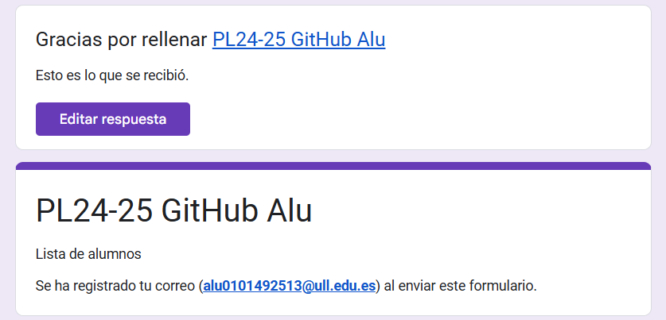
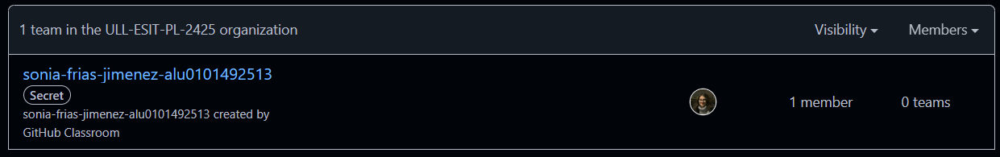
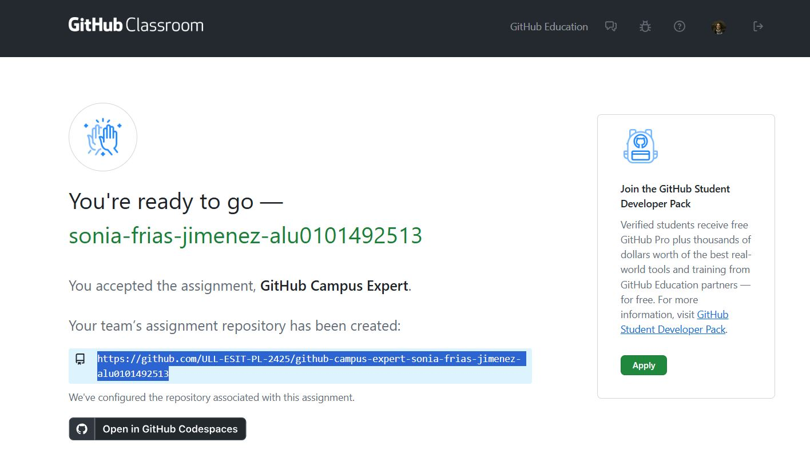
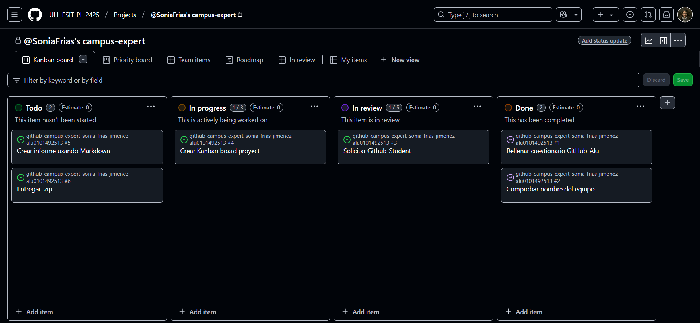
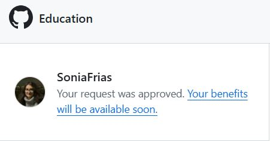

# Github Campus Expert 

- Sonia 
- Frías Jiménez
- alu0101492513

**índice**
1. 
2. 
3. 
4. 
5. 

## Rellenar el cuestionario GitHub-Alu del campus virtual y recibir el correo confirmándolo
He rellenado el cuestionario y recibido la confirmación de la misma.

## Crear equipo con nombre correcto
A continuación he creado el equipo siguiendo el formato indicado: nombre-apellido1-apellido2-aluXXXX.

## Aceptar la asignación de la práctica

## Crear un project board kanban para este repositorio
Creé el project board kanban automated asociado al repo. He rellenado los campos con los requisitos
de la práctica y movido las issues a la columna correspondiente.

## Solicitar el GitHub Backpack
Solicito el Student Developer Pack. Aún no están las ventajas activas, pero tal y como se muestra
en la siguiente imagen, ya ha sido aprobada la solitud.

